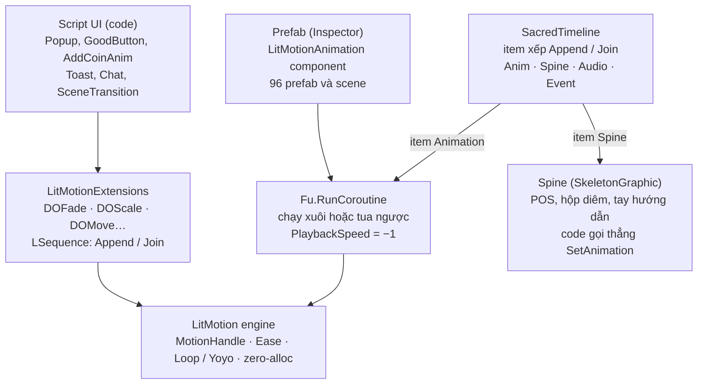

# Báo cáo UI Animation — Mukbang ASMR

2026-10-05 · Team Logos

Toàn bộ animation UI chạy trên **LitMotion** (không có DOTween hay Animator/.anim cho UI), gồm khoảng 40 animation viết bằng code và 96 prefab/scene dựng animation trong Inspector bằng `LitMotionAnimation`. Spine, UIEffect và chỉnh vertex TextMeshPro bổ sung cho những phần tween không làm được.

## Công nghệ đang dùng

Game có 6 cách làm animation UI; hai cách đầu chiếm gần như toàn bộ.

| # | Cách làm | Thư viện / file lõi | Dùng cho | Quy mô |
| --- | --- | --- | --- | --- |
| 1 | Tween bằng code, API kiểu DOTween (`DOScale`, `DOFade`, `DOAnchorPosY`…) | LitMotion + `Scripts/Utils/LitMotionExtensions.cs` | Popup, nút, toast, coin, chat, toggle, chuyển cảnh | ~40 animation trong 30+ script UI |
| 2 | Tween dựng sẵn trong Inspector, gọi từ code qua `RunCoroutine()` | `LitMotionAnimation` (package LitMotion.Animation) + `Fu.RunCoroutine` | Intro Home, hiện/ẩn nhóm nút, kim quay ResultPopup, show custom của popup | 96 prefab/scene; 256 Scale, 47 Position, 18 Rotation, 114 Event component |
| 3 | Timeline ghép tuần tự (Append/Join) tween + Spine + audio + event + SetActive | `Scripts/Utils/SacredTimeline.cs` | StrikeAMatchPopup, kết quả MakeCake, khoe xiên nướng | 5 timeline |
| 4 | Animation khung xương Spine trên UI | `SkeletonGraphic` (spine-unity 4.2) | Máy POS thanh toán, hộp diêm, tay hướng dẫn, nhân vật/pet ở Decorate | 9 prefab UI |
| 5 | Hiệu ứng shader + particle trên UI | UIEffect, UIEffectTweener, UIParticle (mob-sakai) | Icon xám khi khóa, tween shader ở HomeUI, tia lửa diêm, WinFx, BlingParticle | 5 prefab |
| 6 | Chỉnh vertex / ký tự TextMeshPro | `TMPWaveText`, `TMPUIBend`, `maxVisibleCharacters` | Chữ nhấp nhô sóng, chữ uốn cong, hiệu ứng gõ chữ | 3 script + 2 nơi typewriter |

Animation gắn với gameplay (đồ ăn, câu cá, nấu nướng trong `Mechanics/AnimationBehaviour`, `GameplayMukbang`) nằm ngoài phạm vi báo cáo này.

## Danh mục animation UI

44 animation, nhóm theo khu vực. Cột "Cách làm" dùng số thứ tự của bảng Công nghệ (1 = code, 2 = Inspector, 3 = Timeline, 4 = Spine, 5 = UIEffect, 6 = TMP).

| Nhóm | Animation | File | Cách làm | Chuyển động | Thời lượng · Easing |
| --- | --- | --- | --- | --- | --- |
| Popup | Nền mờ hiện/tắt | `Popup.cs` | 1 | Fade alpha nền từ 0 | 0.25s OutQuad · đóng 0.2s InQuad |
| Popup | ScalePopup mở/đóng | `ScalePopup.cs` | 1 | Scale 0.1 → 1, đóng về 0 | 0.25s OutBack · 0.2s InQuad |
| Popup | MoveFromLeftPopup | `MoveFromLeftPopup.cs` | 1 | Trượt X từ mép trái (−rộng màn) về 0 | 0.25s OutQuad · 0.2s InQuad |
| Popup | DetailPopup mở | `DetailPopup.cs` | 1 / 2 | Xoay Z −20° → 0 + scale 0 → 1; hoặc `customShowAnimation` | 0.4s OutQuad + OutBack |
| Popup | DetailPopup con xuất hiện lần lượt | `DetailPopup.cs` | 1 | `movingChildren` scale 0 → 1, cách nhau 0.1s (con đầu 1.1 → 1) | 0.25s OutBack |
| Popup | Nút Close rơi xuống nảy | `DetailPopup.PlayUIDrop` | 1 | 4 bước: rơi 200px + xoay −18° → bật lên 40px +12° → chạm lại −8° → về 0° | 0.5s (50/20/15/15%) · InQuad/OutQuad/OutBounce |
| Popup | DetailPopup đóng | `DetailPopup.cs` | 1 / 2 | Xoay 30° + scale → 0; nếu custom thì tua ngược (PlaybackSpeed âm) | 0.2s OutQuad |
| Popup | DecorateSelectionPopup | `DecorateSelectionPopup.cs` | 1 | Panel trồi từ dưới lên 500px, nút Exit trượt vào 300px | 0.5s OutBack · đóng 0.25s InQuad |
| Popup | Trượt qua lại preview Collab | `SelectACollaboratorPopup.cs` | 2 | `showAnim` / `hideAnim` mỗi preview | theo Inspector |
| Nút & control | GoodButton nhấn | `GoodButton.cs` | 1 | Squash: X ×0.9, Y ×1.05 | 0.15s InOutQuad |
| Nút & control | GoodButton thả | `GoodButton.cs` | 1 | Về scale gốc, nảy đàn hồi | 0.15s OutElastic |
| Nút & control | SwitchToggle | `SwitchToggle.cs` | 1 | Handle trượt X + cross-fade ảnh on/off | 0.2s (Join song song) |
| Nút & control | Thanh tiến trình | `FillSlider.DOValue` | 1 | Tween giá trị slider | mặc định OutQuad |
| Nút & control | Cuộn tới item | `InfiniteScroll.ScrollToIndex` | 1 | Tween vị trí content, kẹp trong vùng cuộn | tuỳ gọi · OutBack |
| Nút & control | Icon khóa màu xám | `HomeIcon.cs` | 5 | Bật/tắt `UIEffect` grayscale theo level | tĩnh |
| Thưởng & feedback | Coin bay về ví | `AddCoinAnim.cs` | 1 | N coin nhỏ bung ra vị trí lệch (0.2s) → nghỉ 0.1s → bay về icon ví (0.5s), mỗi coin trễ 0.1s | OutQuad (mặc định) |
| Thưởng & feedback | Số coin đếm lên | `AddCoinAnim.cs` | 1 | Pop scale 1 → 1.1 → 1, số chạy từ cũ → mới, rồi fade cả khối | 0.5s đếm · fade 0.5s InQuad |
| Thưởng & feedback | Trừ coin | `AddCoinAnim.cs` | 1 | Text "-N" bay lên 50px, fade từ giây 0.5 | 1s |
| Thưởng & feedback | View/EXP bay về + thanh level | `ViewUI.cs` | 1 | Cùng pattern coin bay; EXP đếm lên 1s rồi bật LevelUpPopup | 0.2s + 0.5s · đếm 1s |
| Thưởng & feedback | Tim yêu cầu món | `FoodRequest.cs` | 1 | Tim phồng 1 → 1.25 yoyo 2 lần + số coin thưởng chạy | 0.25s OutQuad |
| Thưởng & feedback | Thẻ yêu cầu biến mất | `FoodRequest.cs` | 1 | Scale → 0 | 0.5s InBack |
| Thưởng & feedback | Kim nhân thưởng | `ResultPopup.cs` | 2 | Kim quay qua lại; góc Z quyết định x5/x4/x3/x2, bấm Claim thì `Pause()` | theo Inspector |
| Thưởng & feedback | Toast thông báo | `UIManager.ShowToast` | 1 | Trồi lên 400px + fade in → giữ 4s → fade out | 0.25s OutBack · out 1s |
| Home & HUD | Intro màn Home | `HomeUI.startAnimation` | 2 | Chuỗi dựng trong Inspector, xong mới chạy bay View | theo Inspector |
| Home & HUD | Nhóm nút hai bên trượt vào/ra | `HomeUI.MoveButton` | 1 | Mỗi nút trượt X ±300px, so le 0.1s | 0.75s OutBack / InBack |
| Home & HUD | Bắt đầu livestream | `HomeUI.onMainAnimation` | 2 | Chuỗi Inspector → rung điện thoại 2 lần → thẻ yêu cầu pop 0 → 1 | pop 0.25s OutBack |
| Home & HUD | Panel hiện/ẩn | `BasePanel.DoSetActive` | 1 | Fade + scale Y 1.2 → 1 | 0.5s OutBack / InBack |
| Home & HUD | Bảng chọn nguyên liệu | `SelectionView.cs` | 1 | Trồi Y từ −600px, xác nhận thì tụt xuống | 0.5s OutBack |
| Home & HUD | Thanh nút MakeCake | `MakeCakeUI.cs` | 2 | `uiBotBtnAnim` / `uiOtherAnim` chạy xuôi/ngược | theo Inspector |
| Chat livestream | Tin nhắn mới | `ChatMessaage.cs` | 1 | Bong bóng scale 0 → 1; tin cũ đẩy lên 100px; tin tràn fade rồi trả pool | 0.4s OutBack / OutQuad · fade 0.8s |
| Chat livestream | Emoji bay | `Emoji.cs` | 1 | Bay lên 150px, trôi X ngẫu nhiên ±40px, scale 0.8 → 1.05, fade 1 → 0 | 1.2s × (0.95–1.15) OutQuad/OutQuint |
| Chuyển cảnh | Loading đầu game | `SceneTransition.InitLoading` | 1 | Slider chạy 0 → 1 tối đa 7s; có quảng cáo thì tua x10 | 7s |
| Chuyển cảnh | Fade giữa 2 scene | `SceneTransition.DoProgress` | 1 | CanvasGroup che màn fade in/out | 0.25s OutQuad / InQuad |
| Chữ | Gõ chữ từng ký tự | `MakeCakeRequest.cs`, `ShippingUI.cs` | 6 | Tween `maxVisibleCharacters` 0 → số ký tự, kèm tiếng lào xào | 2s / 1.5s Linear |
| Chữ | Chữ nhấp nhô sóng | `TMPWaveText.cs` | 6 | Mỗi frame đẩy vertex theo `abs(sin(t·freq + i·offset))` | liên tục |
| Chữ | Chữ uốn cong | `TMPUIBend.cs` | 6 | Map vertex lên cung tròn bán kính `radius` (tĩnh) | tĩnh |
| Chữ | Dấu chấm "…" chờ mạng | `NoInternet.cs` | code | Coroutine đổi "", ".", "..", "..." | 0.2s/bước |
| CookBook | Lật trang | `PageView.cs` | 1 | Góc Y 0 → −180° (gập ngược lại), đổi mặt trang ở −90° | `pageTurnDuration`, easing Inspector |
| CookBook | Kéo lật trang theo tay | `PopupCookBook.cs` | 1 | Góc theo khoảng kéo (Lerp), thả tay thì tween nốt phần còn lại | tỉ lệ góc còn lại |
| CookBook | Công thức hiện ra / nút trang | `RecipeView.cs`, `PopupCookBook.cs` | 1 | Fade 0 → 1 + scale OutBack; nút trượt Y 200px | 0.5s · nút 0.15s Linear |
| CookBook | Công thức mới bay vào sách | `NewRecipePopup.cs` | 1 | Tween vị trí về cuốn sách rồi chạy anim sách | OutQuad |
| Spine UI | Máy POS thanh toán | `PaymentPopup.cs` | 4 | `loading` → `idle2`, kèm rung + âm quét | theo Spine |
| Spine UI | Hộp diêm + quẹt diêm | `StrikeAMatchPopup.cs`, `MatchStickDragHandler.cs` | 3 / 4 / 5 | Hộp `mo` → `mo_idle` loop; que diêm nhún Y +200px yoyo vô hạn; UIParticle tia lửa | que 0.5s yoyo |
| Spine UI | Hải sản bay về ô đếm | `FishingUI.cs` | 1 | Đường cong Bezier bậc 2, điểm điều khiển nâng `arcHeight` | `duration` Linear |

## Cách làm chi tiết

Mọi tween UI đi qua lớp bọc `LitMotionExtensions`, nên cú pháp giống DOTween nhưng trả về `MotionHandle` của LitMotion (zero-alloc).

### 1. Lớp bọc API kiểu DOTween

Mỗi hàm `DOxxx` tạo `LMotion.Create` + `WithEase` + `WithCancelOnError` rồi bind vào thuộc tính. Tham số `from` đảo chiều, `relative` cộng vào giá trị hiện tại.

```csharp
// Scripts/Utils/LitMotionExtensions.cs
public static MotionHandle DOFade(this CanvasGroup cg, float value, float duration,
    Ease ease = Ease.OutQuad, bool from = false, bool relative = false) {
    var start = cg.alpha;
    var end = relative ? start + value : value;
    var lm = from ? LMotion.Create(end, start, duration) : LMotion.Create(start, end, duration);
    return lm.WithEase(ease).WithCancelOnError().BindToAlpha(cg);
}
```

Ghép chuỗi dùng `LSequence` (`Append` = nối tiếp, `Join` = song song, `Insert` = đặt ở mốc thời gian, `AppendInterval` = nghỉ). Đợi trong coroutine bằng `.ToYieldInstruction()`; chạy việc sau khi xong bằng `this.DoAfter(handle, callback)`.

### 2. Popup: Template Method

`Popup` lo phần chung (fade nền, dời nội dung khi có MREC, hủy khi đóng). Lớp con chỉ viết `DoShow` / `DoHide`. Popup mới chỉ cần kế thừa `ScalePopup`, `MoveFromLeftPopup` hoặc `DetailPopup`.

```csharp
public abstract class ScalePopup : RootPopup {
    protected override IEnumerator DoShow()
        => root.DOScale(0.1f, 1f, OPEN_TIME, Ease.OutBack).ToYieldInstruction();
    protected override IEnumerator DoHide()
        => root.DOScale(0f, CLOSE_TIME, Ease.InQuad).ToYieldInstruction();
}
```

`DetailPopup` gom mọi handle vào `CompositeMotionHandle canceler`; khi đóng gọi `canceler.Cancel()` để không tween nào chạy dở. Khi có `customShowAnimation`, đóng popup = tua ngược chính animation đó bằng `PlaybackSpeed = -Duration / CLOSE_TIME`.

### 3. Nút bấm squash & stretch

`GoodButton` kế thừa `Button`: nhấn thì bóp ngang 0.9 / kéo dọc 1.05 (InOutQuad), thả thì bật về bằng OutElastic. Handle cũ luôn bị `Cancel()` trước khi tạo mới để bấm liên tục không giật. Yêu cầu pivot (0.5, 0.5); có menu "Fix Pivot" trong Editor.

### 4. Coin / View bay về ví

Đây là pattern dùng chung cho `AddCoinAnim` và `ViewUI`: một nhóm icon nhỏ đặt sẵn trong prefab, lưu vị trí gốc làm "điểm bung".

```csharp
for (int i = 0; i < coinMiniIcons.Length; i++) {
    var icon = coinMiniIcons[i];
    icon.localPosition = Vector3.zero;              // gom về tâm
    LSequence.Create()
        .AppendInterval(i * 0.1f)                    // so le từng coin
        .Append(icon.DOLocalMove(arrPosMiniIcons[i], 0.2f)) // bung ra
        .AppendInterval(0.1f)
        .Append(icon.DOMove(coinIcon.position, 0.5f))       // bay về ví
        .Run();
}
// song song: số coin pop + đếm từ cũ lên mới
seq2.Append(LMotion.Create(coin - addCoin, coin, 0.5f)
    .Bind(f => coinText.text = Fu.NumberToKMB(f)));
```

### 5. Animation dựng trong Inspector

Gắn component `LitMotionAnimation`, thêm các track (Scale, Position, Rotation, Punch, CanvasGroup Alpha, Event…). Từ code gọi `yield return anim.RunCoroutine()` để chạy xuôi, `RunCoroutine(false)` để tua ngược (đặt `Time = Duration`, `PlaybackSpeed = -1`). Game tự thêm 2 track: `BouncingScaleAnimation` (nẩy dẹt–cao–về gốc, 3 nhịp) và `SpiralMoveAnimation`.

### 6. Timeline ghép nhiều loại

`SacredTimeline` là danh sách item, mỗi item là Animation / Spine / Audio / Event / SetActive / Delay, xếp Append hoặc Join, có `delay` và `loops`. Có nút Play/Stop xem trước ngay trong Editor (tự Undo sau khi xem).

### 7. Hiệu ứng chữ

- Gõ chữ: đặt `maxVisibleCharacters = 0`, `ForceMeshUpdate()`, rồi `LMotion.Create(0, characterCount, 1.5f).Bind(v => text.maxVisibleCharacters = v)`.
- Chữ sóng: `TMPWaveText` cache vertex gốc, mỗi frame cộng `|sin(t·frequency + i·waveOffset)| × amplitude × fontSize` vào trục Y; tự bake lại khi text đổi.
- Chữ cong: `TMPUIBend` bắt `OnPreRenderText`, đổi (x, y) sang toạ độ trên cung tròn bán kính `radius`.

## Quy ước timing và easing

Vào nhanh bằng **OutBack** (có vượt đà), ra nhanh hơn bằng **InQuad**; chỉ popup có hằng số chung, còn lại khai báo rời từng file.

| Loại | Mở / vào | Đóng / ra | Nguồn hằng số |
| --- | --- | --- | --- |
| Popup chuẩn | 0.25s OutBack (scale) / OutQuad (trượt) | 0.2s InQuad | `Popup.OPEN_TIME`, `Popup.CLOSE_TIME` |
| DetailPopup | 0.4s OutBack + xoay OutQuad | 0.2s | `DetailPopup.NEW_OPEN_TIME` |
| Nút bấm | 0.15s InOutQuad | 0.15s OutElastic | `GoodButton.ANIMATION_DURATION` |
| Toggle | 0.2s mặc định OutQuad | 0.2s | `SwitchToggle.ANIM_TIME` |
| Panel | 0.5s OutBack + fade Linear | 0.5s InBack | `BasePanel.ANIM_TIME` |
| Chuyển cảnh | 0.25s OutQuad | 0.25s InQuad | `SceneTransition.ANIM_TIME` |
| Pop nhỏ (thẻ, tim, số) | 0.1–0.25s OutBack / OutQuad | 0.5s InBack | rải rác |
| Trượt nhóm nút / bảng | 0.5–0.75s OutBack, so le 0.1s | InBack / InQuad | rải rác |
| Stagger (lần lượt) | 0.1s giữa các phần tử | — | `Const.WAIT_0_1`, `i * 0.1f` |

Easing mặc định của lớp bọc là `Ease.OutQuad`; vì vậy các tween không ghi easing (ví dụ coin bay `DOMove`) thực tế chạy OutQuad.

## Lưu ý kỹ thuật

- `Assets/Resources/DOTweenSettings.asset` còn sót lại dù không còn script nào `using DG.Tweening` — có thể xóa.
- Một số tween không giữ handle nên không hủy được khi object bị tắt/trả pool: scale + fade của `Emoji`, scale đóng của `FoodRequest`, nút trang `PopupCookBook`. Hiện dựa vào `WithCancelOnError` để không crash.
- Thời lượng/easing ngoài popup bị hard-code rải rác (0.1 / 0.25 / 0.5 / 0.75s); nếu cần chỉnh "cảm giác" toàn game thì nên gom về 1 chỗ.

## Kiến trúc



Code và Inspector đi hai đường khác nhau nhưng cùng kết thúc ở LitMotion; SacredTimeline là chỗ duy nhất ghép tween với Spine, audio và event trong một chuỗi.
